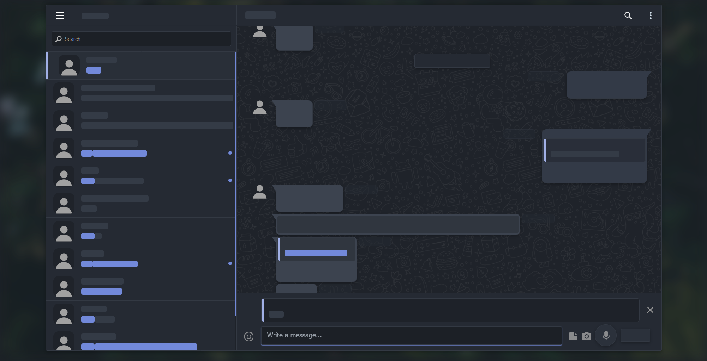

  
   
  <h1>Dark-Telegram</h1>

Dark mode implementation for [Telegram Web](https://web.telegram.org/) based on the awesome [Dark WhatsApp style by vednoc](https://github.com/vednoc/dark-whatsapp) with many improvements and wide range of customization options.

  
   
  

Currently at version 1.0.4 most features are ported from the original style, I will continue to work on it to add more cool things. 
Feel free to contribute and make sure to check [Dark-WhatsApp style by vednoc](https://github.com/vednoc/dark-whatsapp)!

## Features
* Some animations including contact list hover and private mode
* Border sizes for bubbles, icons and whole page
* Hide contacts initials
* Custom icons for contacts (to match original style) (group icons currently not supported by telegram)
* Emoji popup positioning (wip)
* Vignette effect fot photo thumbs (video thumbs currently not supported)
* Compact mode
* Messages tails
* And working to bring more from the original style including:
  * Fullscreen mode
  * Messages bubble position
  * Emoji's transparency
  * Custom chat window width
* <i>and more ...</i>

See the [Changelog](Changelog) for more details.

## Credits
Full credit for design goes to original style creators at [vednoc](https://github.com/vednoc).

### License:
Code released under the [MIT](LICENSE) license.
